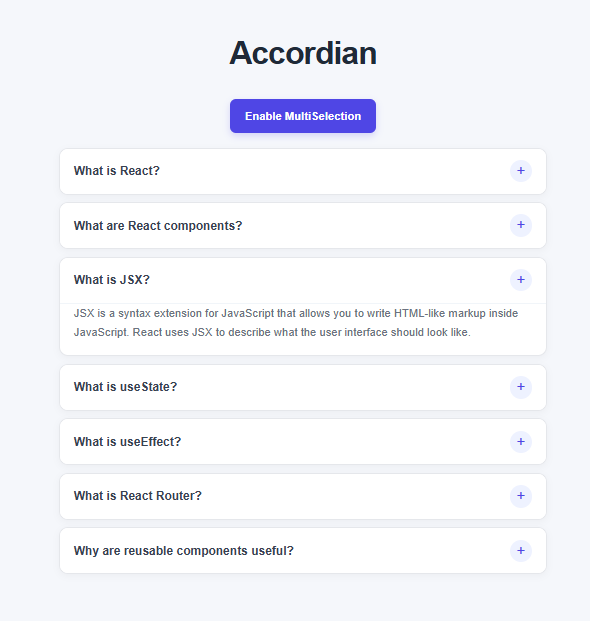

# Projects
# My Projects

A collection of projects I've built while learning, experimenting, and developing my skills in software development.

---

<h2>Travel Tour Website</h2>

### Overview

A responsive travel and tour website built with **React.js**, designed to provide users with an engaging way to explore destinations, browse tours, and navigate through travel-related information.

This project was built as part of my journey of learning and practicing **React, React Router, reusable components, Tailwind CSS, and third-party React libraries**.

### Features

* Interactive homepage with a large hero section
* Multi-page navigation using React Router
* Featured travel destinations
* Destination cards with images, ratings, prices, and trip duration
* Travel search and booking interface
* Responsive navigation with a mobile menu
* Responsive UI using Tailwind CSS
* Carousel and slider interactions
* Scroll-to-top functionality
* Interactive icons and UI elements

### Technologies

**React.js** • **React Router** • **Tailwind CSS** • **Vite** • **React Icons** • **Lucide React** • **React Slick**

### What I Learned

This project helped me understand how individual React concepts come together to build a complete frontend application.

I practiced:

* Functional components
* JSX
* Props
* State with `useState`
* Side effects with `useEffect`
* Event handling
* Rendering lists with `.map()`
* React Router
* Reusable components
* Responsive design
* Working with third-party libraries
* Debugging dependency and import issues

### Future Improvements

* User authentication
* Functional destination search
* Individual tour detail pages
* Booking and payment functionality
* Wishlist functionality
* User reviews and ratings
* Backend and API integration
* Database integration

### Status

**Complete**

---

<h2>Accordion</h2>

### Preview

### Overview

A React-based Accordion application that displays questions and answers in an interactive expandable interface.

The project supports both **single selection** and **multiple selection** modes, allowing users to control how many accordion items can remain open at the same time.

### Features

* Expand and collapse accordion items
* Single selection mode
* Multiple selection mode
* Toggle between single and multiple selection
* Dynamic rendering of questions and answers
* Interactive user interface

### Technologies

**React.js** • **JavaScript** • **CSS** • **Vite**

### What I Learned

This project helped me understand how React state can be used to control the visibility of different elements and how the same component can behave differently depending on the state.

I practiced:

* Functional components
* JSX
* Props
* State with `useState`
* Event handling
* Conditional rendering
* Rendering lists with `.map()`
* Managing single selected items
* Managing multiple selected items
* Working with arrays in state

### Future Improvements

* Add smooth open and close animations
* Add different icons for expanded and collapsed items
* Improve accessibility
* Add keyboard navigation
* Improve responsive design

### Status

**Complete**

---

<h2>Color Generator</h2>

## Preview

### Overview

A React-based Color Generator that generates random colors in **HEX and RGB formats** and dynamically applies the generated color to the application background.

The project allows users to switch between color formats and generate a new random color with a button.

### Features

* Generate random HEX colors
* Generate random RGB colors
* Switch between HEX and RGB color formats
* Generate a new random color
* Display the generated color value
* Dynamically change the background color

### Technologies

**React.js** • **JavaScript** • **CSS** • **Vite**

### What I Learned

This project helped me understand how React state can control both displayed information and styling dynamically.

I practiced:

* Functional components
* JSX
* State with `useState`
* Side effects with `useEffect`
* Event handling
* Conditional logic
* Random number generation
* Dynamic inline styling
* Working with HEX and RGB color values

### Future Improvements

* Add a copy-to-clipboard button
* Add HSL and other color formats
* Display color history
* Add a color palette generator
* Add improved color contrast information

### Status

**Complete**

---

<h2>Image Slider</h2>

## Preview

### Overview

A React-based Image Slider that fetches images from an external API and displays them one at a time in an interactive carousel.

Users can navigate between images using previous and next buttons or select a specific image using the indicator buttons.

### Features

* Fetch images from an external API
* Previous and next navigation
* Image indicator buttons
* Dynamic image rendering
* Loading state
* Error handling
* API-based image data

### Technologies

**React.js** • **JavaScript** • **CSS** • **Vite** • **React Icons** • **REST API**

### What I Learned

This project introduced me to working with external APIs and handling asynchronous data inside a React application.

I practiced:

* Functional components
* JSX
* Props
* State with `useState`
* Side effects with `useEffect`
* API requests with `fetch()`
* `async/await`
* Conditional rendering
* Error handling
* Rendering API data with `.map()`
* Managing the current image using state
* Handling button and click events

### Future Improvements

* Add automatic image sliding
* Add pause and play functionality
* Add animation between slides
* Add keyboard navigation
* Improve mobile responsiveness

### Status

**Complete**

---

<h2>Load More</h2>

## Preview

### Overview

A React-based product listing application that fetches products from an external API and displays them dynamically.

The application initially loads a set of products and allows users to load additional products using a **Load More** button.

### Features

* Fetch products from an external API
* Display products dynamically
* Load additional products on button click
* Pagination using API parameters
* Product cards with images and titles
* Loading state
* Disable the button when no more products are available

### Technologies

**React.js** • **JavaScript** • **CSS** • **Vite** • **REST API**

### What I Learned

This project helped me understand how API pagination works and how new data can be added to existing React state without replacing previously loaded data.

I practiced:

* Functional components
* JSX
* State with `useState`
* Side effects with `useEffect`
* API requests
* `async/await`
* Pagination using `limit` and `skip`
* Updating arrays using the spread operator
* Conditional rendering
* Event handling
* Managing loading states

### Future Improvements

* Add infinite scrolling
* Add product categories
* Add search functionality
* Add filtering and sorting
* Add product details

### Status

**Complete**

---

<h2>Star Rating</h2>

## Preview

### Overview

A React-based interactive Star Rating component that allows users to select a rating by clicking on stars and preview a rating using hover interactions.

The number of stars can also be controlled through a component prop.

### Features

* Interactive star rating
* Click to select a rating
* Hover preview
* Active and inactive star states
* Dynamic number of stars
* Reusable component

### Technologies

**React.js** • **JavaScript** • **CSS** • **Vite** • **React Icons**

### What I Learned

This project helped me understand how different pieces of state can work together to create interactive user interfaces.

I practiced:

* Functional components
* JSX
* Props
* State with `useState`
* Event handling
* Mouse events
* Conditional styling
* Dynamic rendering
* Working with component props
* Creating arrays dynamically

### Future Improvements

* Add half-star ratings
* Add rating reset functionality
* Display the selected rating numerically
* Add animation effects
* Make the component more reusable

### Status

**Complete**

---

<h2>Weather App</h2>

## Preview

### Overview

A React-based Weather Application that retrieves current weather information from the **OpenWeather API**.

Users can search for a city and view information such as temperature, weather description, wind speed, humidity, and country.

### Features

* Search weather by city name
* Fetch weather data from an external API
* Display city and country
* Display current temperature
* Display weather description
* Display wind speed
* Display humidity
* Loading state
* Dynamic weather information

### Technologies

**React.js** • **JavaScript** • **CSS** • **Vite** • **REST API** • **OpenWeather API**

### What I Learned

This project gave me more practice working with external APIs and handling asynchronous data based on user input.

I practiced:

* Functional components
* JSX
* State with `useState`
* Side effects with `useEffect`
* API requests
* `async/await`
* Event handling
* Search functionality
* Conditional rendering
* Optional chaining
* Accessing nested API data
* Displaying dynamic information

### Future Improvements

* Add weather icons
* Add a five-day forecast
* Add current location weather
* Add temperature unit conversion
* Improve error handling for invalid cities
* Add more weather information

### Status

**Complete**

---

<h2>Dynamic Menu</h2>

## Preview

### Overview

A React-based Dynamic Menu project that displays menu items in a nested tree structure.

The menu supports multiple levels of nested items, and users can expand or collapse sections containing child menu items.

### Features

* Dynamic menu rendering
* Nested menu items
* Expand and collapse functionality
* Multiple levels of nesting
* Dynamic plus and minus icons
* Recursive menu rendering
* Interactive navigation structure

### Technologies

**React.js** • **JavaScript** • **CSS** • **Vite** • **React Icons**

### What I Learned

This project introduced me to one of the more interesting React patterns I have worked with: **recursive components**.

I practiced:

* Functional components
* JSX
* Props
* State with `useState`
* Conditional rendering
* Event handling
* Nested data structures
* Rendering lists with `.map()`
* Recursive components
* Managing the state of individual menu items
* Passing data between components

### Future Improvements

* Add menu item links
* Add active menu states
* Add animations for expanding and collapsing
* Support unlimited nested levels
* Add icons for different menu categories

### Status

**Complete**

---

<h2>Food Recipe App</h2>

## Preview

### Overview

A React-based recipe application that allows users to search for recipes, view detailed recipe information, and manage their favorite recipes.

The project brings together several React concepts into a more complete application, including **Context API, React Router, API integration, reusable components, and shared state management**.

### Features

* Search for recipes
* Fetch recipe data from an external API
* Display recipe cards
* View detailed recipe information
* Display recipe ingredients
* Add recipes to favorites
* Remove recipes from favorites
* Favorites page
* Dynamic recipe detail pages
* Navigation between application pages
* Shared state using Context API

### Technologies

**React.js** • **JavaScript** • **Tailwind CSS** • **React Router** • **Context API** • **Vite** • **REST API**

### What I Learned

This project helped me understand how different React concepts work together in a larger application.

I practiced:

* Functional components
* JSX
* Props
* State with `useState`
* Side effects with `useEffect`
* Context API with `useContext`
* React Router
* Dynamic routes
* URL parameters
* API integration
* Asynchronous JavaScript
* Conditional rendering
* Reusable components
* Shared application state
* Managing favorites
* Styling with Tailwind CSS

### Future Improvements

* Add user authentication
* Persist favorites using local storage
* Add recipe categories
* Add advanced search and filtering
* Add recipe ratings
* Add pagination
* Improve error handling
* Add nutritional information

### Status

**Complete**

<h2>Mini Store</h2>

### Overview

A modern product store built with **React.js**, demonstrating state management using **Context API** and **Redux Toolkit**. The application allows users to browse products fetched from an external API, add products to a shopping cart, manage quantities, and switch between light and dark themes.

### Light Theme

### Dark Theme

### Features

- Fetches products from an external API
- Product listing with reusable components
- Add products to the shopping cart
- Increase and decrease product quantities
- Remove products from the cart
- Displays the total cart price
- Light and dark theme toggle
- Shared theme state using Context API
- Global application state using Redux Toolkit
- Asynchronous API handling using `createAsyncThunk`

### Technologies Used

- React.js
- Redux Toolkit
- React Redux
- Context API
- JavaScript
- CSS
- Vite
- Fake Store API

### Concepts Practiced

- Components and Props
- `useState`
- `useEffect`
- Context API
- `useContext`
- Redux Store
- Redux Slices
- Actions and Reducers
- `useSelector`
- `useDispatch`
- `createAsyncThunk`
- API Integration
- Global State Management
- Asynchronous State Management

### Status

**Complete**

